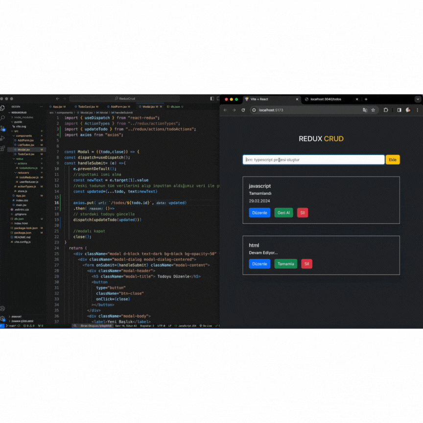

# State Yönetimi:

- State: Uygulamadaki bileşenlerin sahip olduğu bilgi ve özellik.

- Prop Drilling: Bileşenlerin yukardan aşağı veri taşıması

- Context API: Uygulamadaki state'i, oluşturduğumuz merkezlerden yönettiğimiz state yönetim aracı.

- Redux: Bileşenlerin sahip olduğu ve merkezi olarak tutulması gereken statetlerin yönetildiği merkezi state yönetim aracı.

# Neden REDUX?

- Kod tekrarını önler.
- Performansı artırır.
- Bileşen içindeki karışıklığı azaltır.
- Hata ayıklamak daha kolay.
- Orta ve büyük ölçekli projelerde stat tönetimi daha kolay.

# Redux Kavramları:

1. Store: Uygulamanın tüm bileşenleri tarafından erişilebilnen ve yönetilen state deposu. (Okulun binası)

2. Reducer: Aksiyonun tipine göre stor'da tutulan statin nasıl değişeceğine karar verir. (Okulun yönetim ekibi)

3. Action: Store'daki stati güncellemek için reducer'a göndderdiğimiz emir/haber (Yeni kayıt, okuldan atılma)

- - Action iki değere sahip bir objedir.
- Type: Action'un görevini tanımlayan string ("TODO_EKLE)
- payload: Gönderilen eylemin verisini

4. Dispatch (Sevketmek): Action gerçekleştirdiğini reducer'a haber veren metod. (Nöbetçi öğrenci, öğretmen, sınıf annesi)

5. Subscribe (Abone Olma): Bileşenlerin storda tutulan verilerine erişimini sağlama (useContext, useSelector) (E-okul)

6. Provider (Sağlayıcı): Storda tutulan verileri uygulamıyı sağlar. (Okuldaki hizmet sağlayıcısı)

# Redux Kurulum Aşamaları:
- npm i redux react-redux 
- reducer kurulumlarını yap
- store kurumunu yap
- store'a projeyi tanıt.

# ReduxCrud Proje Gif:
# NoteProject
# ReduxCrud
